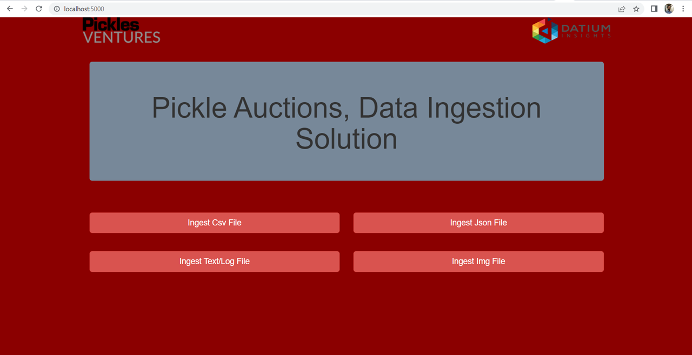

# Pickles_Auctions_Test
Pickles_Auctions_ETL_Pipeline

To run the project 
please extract the project 

> type from your terminal cd Pickles_Auctions & 

> Install all dependencies pip3 install -r requirements.txt 

> type "flask run" and enter 

> type in your browser "http://localhost:5000/"
 
You may able to see the framework's UI. 

First Screen

